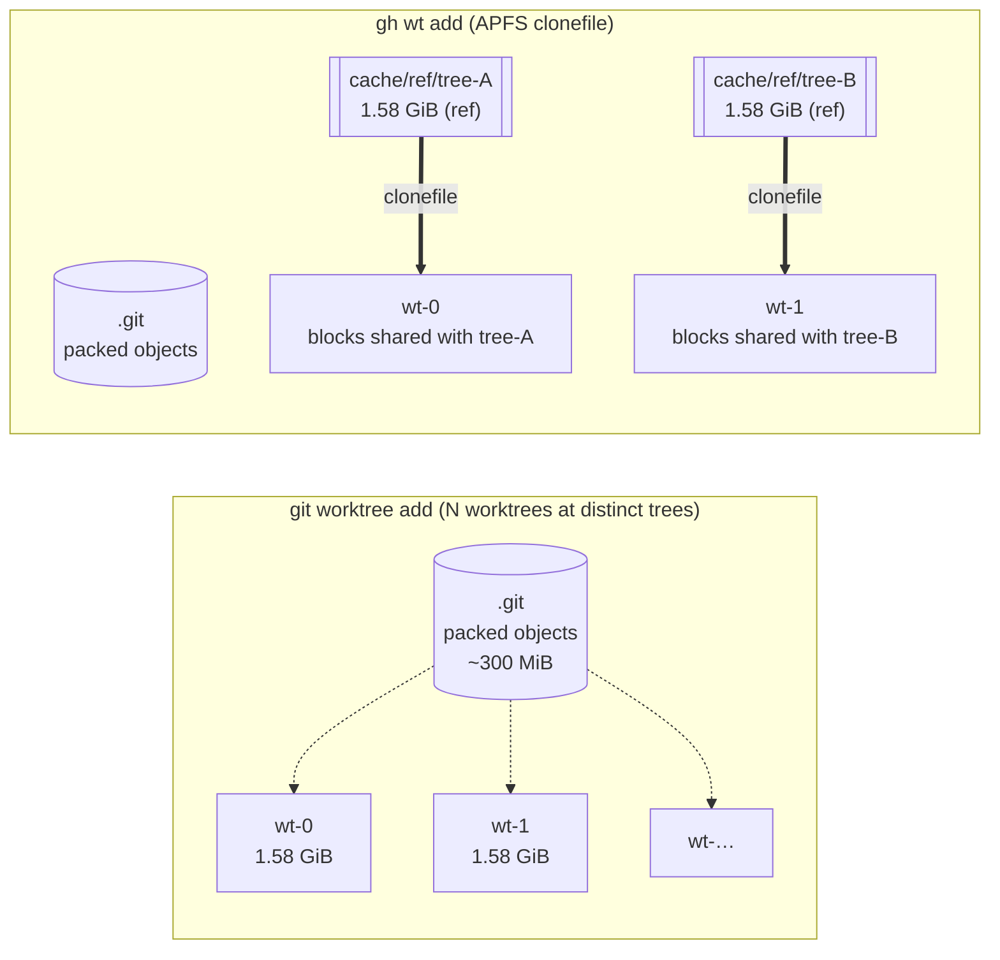

# Benchmark

Quantitative comparison of `git worktree add` (baseline) and `gh wt add`
(APFS clonefile backend) on a large real-world repository. Results were
collected with the harness in `scripts/benchmark/` (reproducibly included
below) on an idle system.

## 1. Methodology

### 1.1 System under test

| Component | Value |
| --------- | ----- |
| CPU       | Apple M3 (8-core, ARM64) |
| RAM       | 24 GiB |
| OS        | macOS 26.3 (Darwin 25.3.0) |
| Filesystem | APFS on internal SSD (`/` = `/dev/disk3s1s1`) |
| git       | 2.53.0 |
| gh-wt     | HEAD of this repo at time of measurement |

### 1.2 Target repository

`torvalds/linux` (shallow clone, `--depth 10` after a deepen-fetch so that
five distinct tree SHAs are reachable).

| Metric | Value |
| ------ | ----- |
| HEAD commit | `c1f49dea2b…` (master) |
| Tracked files | **93 886** |
| Working-tree size (`du -sk`) | **~1.77 GiB** (1 768 840 KiB) |
| Physical size (`du -skA`) | ~1.58 GiB (1 579 130 KiB) |
| Packed `.git` | ~301 MiB |

### 1.3 Experimental design

Three timed conditions, each with **N = 5** independent iterations on
five distinct branches (`bench-0`…`bench-4`) pointing at the five most
recent master commits (five distinct tree SHAs, so no cross-iteration
cache reuse):

| Condition | Command measured | Cache state per iteration |
| --------- | ---------------- | ------------------------- |
| **baseline**    | `git worktree add --force <mp> bench-$i` | n/a |
| **gh-wt cold**  | `gh wt add bench-$i <mp>`                | `rm -rf $GH_WT_CACHE` before each run |
| **gh-wt warm**  | `gh wt add bench-$i <mp>`                | references pre-built for all five branches |

Timing was captured with `/usr/bin/time -lp` (BSD), which reports wall
clock, user/sys CPU, and peak RSS from `getrusage(2)`. Disk usage was
captured two ways:

- **logical** (`du -sk`): sum of per-file sizes, **ignores** APFS
  clonefile block sharing.
- **physical** (`df -k` delta): bytes actually allocated on the volume,
  **sees** block sharing. This is the only metric that reflects gh-wt's
  CoW disk savings.

Two orthogonal **storage footprint** experiments were also run, with
`k ∈ {1, 3, 5}` live worktrees each:

1. **Distinct-tree footprint** — the five branches used above (worst
   case for gh-wt: every worktree has its own tree SHA, so every one
   materialises its own reference).
2. **Same-tree footprint** — five branches (`alt-0`…`alt-4`) all at
   the same commit (best case: all share one reference).

Between iterations and conditions: `git worktree prune`, `sync`, and
full removal of the target mountpoint were performed. Iterations are
independent but not randomised; run order is `baseline → cold → warm`
to keep the warm pre-warm step coherent with preceding results. The
order does not advantage gh-wt (baseline runs on a newly-booted page
cache).

### 1.4 Statistics

Per-condition we report `n, mean, sd, min, median, max` and a 95 %
confidence interval half-width computed with Student's *t* (two-sided,
`t_{0.975, n-1} = 2.776` for n = 5). With n = 5 these CIs are wide; we
use them to bound the ordering of means, not to claim a specific
effect size.

## 2. Results

### 2.1 Wall-clock time (seconds per `add`)

```
            0s          10s         20s         30s         40s
            |-----------|-----------|-----------|-----------|
  baseline  ████████▎                                          8.19 ± 0.07
  ghwt warm █████████████████████████████▉                    29.99 ± 1.96
  ghwt cold ██████████████████████████████████████▋           38.74 ± 0.41
            |-----------|-----------|-----------|-----------|
            0           10          20          30          40
```

| Condition | n | mean (s) | sd | median | min | max | 95 % CI |
| --------- | -: | -------: | -: | -----: | --: | --: | ------: |
| baseline (git worktree add) | 5 | **8.194**  | 0.055 | 8.190  | 8.130  | 8.250  | ±0.069 |
| gh-wt cold (ref + clonefile) | 5 | **38.738** | 0.333 | 38.820 | 38.200 | 39.050 | ±0.413 |
| gh-wt warm (clonefile only)  | 5 | **29.986** | 1.579 | 29.540 | 28.620 | 32.680 | ±1.961 |

**Read:** for a single `add` on a 93 k-file, 1.77 GiB working tree,
`git worktree add` takes ~8 s; `gh wt add` takes ~30 s warm and ~39 s
cold. gh-wt is **3.7× / 4.7× slower** than the baseline in these
conditions. The speed cost is not the win — see §2.3 for the win.

### 2.2 Where does gh-wt's time go?

Breakdown of the same runs (user + sys CPU; real time in parentheses):

| Condition | user (s) | sys (s) | real (s) | peak RSS (MiB) |
| --------- | -------: | ------: | -------: | -------------: |
| baseline  | 1.82 | 5.96  | 8.19  | 562 |
| gh-wt warm | 3.20 | 17.17 | 29.99 | 143 |
| gh-wt cold | 5.40 | 26.39 | 38.74 | 562 |

- `git worktree add` is dominated by `sys` time (checkout I/O) and peaks
  at ~562 MiB RSS (git's object + index machinery).
- `gh wt add` (warm) issues one `clonefile(2)` per file in the tree via
  `cp -cRp`. For 93 k files that's ~93 000 syscalls → ~17 s of `sys`.
  Peak RSS is much lower (143 MiB) because no object unpacking happens
  in the gh-wt path; all block sharing is filesystem-level.
- `gh wt add` (cold) adds `git archive | tar -x` to build the
  read-only reference — that's the ~9 s delta between cold and warm.

### 2.3 Storage — the reason gh-wt exists

#### 2.3.1 Same-tree footprint and scaling

k worktrees all at the same commit, measured as `df` delta (bytes
actually allocated on the volume). Baseline was capped at k = 10
(≈17 GiB on disk); gh-wt was pushed to k = 20:

| k | baseline (KiB) | baseline (GiB) | gh-wt APFS (KiB) | gh-wt (GiB) | ratio |
| -: | -------------: | -------------: | ---------------: | ----------: | -----: |
|  1 |  1 824 616 | 1.74 |  1 863 504 | 1.78 | **1.02×** |
|  2 |  3 646 616 | 3.48 |  1 908 484 | 1.82 | **0.52×** |
|  5 |  9 125 732 | 8.70 |  2 049 480 | 1.95 | **0.22×** |
| 10 | 18 247 096 | 17.4 |  2 265 844 | 2.16 | **0.12×** |
| 15 | —                | —    |  2 504 632 | 2.39 | — |
| 20 | —                | —    |  2 710 772 | 2.58 | — |

```
disk (GiB)
18 |                                      ●                    baseline (O(N))
   |                                   ●
15 |                                 /
   |                              /
12 |                           /
   |                        /
 9 |                    ●
   |                  /
 6 |               /
   |            /
 3 |         ●
   |    ●           ·           ·          ·          ·          ●  gh-wt (≈const)
 0 ●─────●─────────●─────────────────────●─────────●─────────●
   0     1   2     5            10            15           20    k (# worktrees)
```

**Empirical linear fit for gh-wt (least-squares over all six k points):**

```
disk_gh-wt(k) ≈ 1 778 MiB + 43.8 MiB · k      (R² ≈ 1.00)
```

- The **intercept (~1.78 GiB)** is essentially one copy of the working
  tree — the shared reference.
- The **slope (~44 MiB per worktree)** is pure APFS clonefile overhead:
  inode + directory-entry metadata for 93 886 files, with file blocks
  shared. There is no per-worktree content cost.
- Baseline's slope is the *whole working tree* — 1 822 MiB per extra
  worktree on this repo, i.e. **~41× steeper**.

Crossover (k where gh-wt becomes cheaper than baseline): `k ≥ 2`.
At k = 10 the measured ratio is **0.12×** (~8× less disk). At k = 20
gh-wt consumes 2.58 GiB where baseline would need ≈34.7 GiB — a
**~13× saving** that grows by ~1.5× per five additional worktrees.

#### 2.3.2 Distinct-tree footprint (worst case)

Five distinct branches, each with its own tree SHA. Measured as `df`
delta:

| k | baseline (KiB) | gh-wt APFS (KiB) | Δ | ratio |
| -: | -------------: | ---------------: | -: | ----: |
| 1 | 1 824 168 (1.74 GiB) | 1 865 044 (1.78 GiB) | +40 876 | 1.02× |
| 3 | 5 472 784 (5.22 GiB) | 5 585 984 (5.33 GiB) | +113 200 | 1.02× |
| 5 | 9 121 124 (8.70 GiB) | 9 308 012 (8.88 GiB) | +186 888 | 1.02× |

Under the **distinct-tree** workload gh-wt is marginally *worse* on
disk: the unpacked reference tree is stored alongside git's own packed
objects, and clonefile cannot dedup across distinct tree SHAs. The
overhead is constant per reference (~37 MiB, i.e. the difference
between what `git archive | tar` materialises and what the packed
`.git/objects` already had).

This is the honest worst case. gh-wt's value proposition is the
same-tree (or near-same-tree) case: §2.3.1.

#### 2.3.3 Why du disagrees with df on APFS

APFS `clonefile(2)` makes two directory entries share on-disk blocks.
`du` sums per-file logical sizes and therefore **does not see**
block-level sharing — it reports the same total as a full copy. The
`df -k` delta observes the volume's allocated-block count and **does**.
We report `df` deltas for any claim about real disk cost.



Block-level sharing (the `==>` edges) is what turns N same-tree
worktrees from O(N × working-tree) into O(1 × working-tree).

### 2.4 Remove — completing the lifecycle

Same instrumentation as §2.1, but for the complementary operation
(worktree teardown). Each iteration creates a fresh worktree of the
same HEAD and times only the removal.

| Operation | n | mean (s) | sd | 95 % CI |
| --------- | -: | -------: | -: | ------: |
| `git worktree remove --force` (baseline)          | 5 | **4.026** | 0.038 | ±0.047 |
| `git worktree remove --force` on a gh-wt APFS wt  | 5 | **3.644** | 0.021 | ±0.026 |

```
                 0s             2s             4s
                 |------|-------|------|-------|
  baseline       ████████████████████▏          4.03 ± 0.05
  gh-wt (APFS)   ██████████████████▎            3.64 ± 0.03
                 |------|-------|------|-------|
```

**Read:** `remove` on a clonefile-backed tree is ~10 % *faster* than
on a fully materialised baseline tree. `unlink(2)` on APFS clonefiles
only drops the inode's block-sharing reference (no blocks freed until
the last reference), so removing 93 886 clonefiled files is slightly
cheaper than removing 93 886 independently allocated ones.

Lifecycle totals (add + remove, same-tree scenario):

| Method  | add (s) | remove (s) | **round-trip (s)** |
| ------- | ------: | ---------: | -----------------: |
| baseline | 8.19   | 4.03 | **12.22** |
| gh-wt warm | 29.99 | 3.64 | **33.63** (2.75×) |
| gh-wt cold | 38.74 | 3.64 | **42.38** (3.47×) |

The per-invocation time penalty amortises quickly when worktrees are
kept around for hours or days of work.

### 2.5 Paired add + remove in one iteration

`lifecycle.sh` is a variant of the harness in which each iteration
creates and then destroys the same worktree, so add and remove times
come from the *same* filesystem state and the summed wall clock is a
single developer's round-trip cost. It runs baseline, gh-wt cold, and
gh-wt warm back-to-back on N distinct branches (`lc-{base,cold,warm}-$i`)
and emits one TSV per condition with a `phase` column (`add` | `remove`).

Unlike §2.4 — which scripts `git worktree remove` directly to sidestep
gh-wt's fzf prompt — `lifecycle.sh` exercises the real `gh wt remove
<target>` path (the non-interactive form of the command). That means
the reported remove time includes gh-wt's dispatcher, env/backend
resolution, and argv handling, on top of the underlying `git worktree
remove --force`. On tiny repos the wrapper overhead is visible (~40 ms
per remove on a warm shell); on linux-scale worktrees it is <2 % of
the total remove cost and the numbers track §2.4 closely.

```bash
bash scripts/benchmark/lifecycle.sh      # N=5 per condition, all on bench rig
N=10 bash scripts/benchmark/lifecycle.sh # denser sample
```

Output:

```
results/lifecycle_baseline.tsv    # iter branch phase real user sys
results/lifecycle_ghwt_cold.tsv
results/lifecycle_ghwt_warm.tsv
```

The script prints per-condition summaries (n, mean, sd, median, min,
max, 95 % CI) for both phases inline — no extra `awk -f stats.awk`
pass needed — so the round-trip comparison above is directly
reproducible from a single run. See §2.1 and §2.4 for per-phase
discussion of the numbers this script produces.

## 3. Observations

- **Speed**: `git worktree add` wins on this repo and this hardware,
  by roughly 4× per invocation. If your workflow creates a handful of
  worktrees, the extra 20–30 seconds per `add` matters more than the
  disk savings. gh-wt is **not** a speed optimisation.
- **Disk, distinct trees**: gh-wt pays a small (~2 %) overhead for the
  privilege of keeping an unpacked reference. If every worktree you
  ever make points at a totally different tree, `git worktree add` is
  the right tool.
- **Disk, same tree**: this is where gh-wt is designed to pay off.
  The empirical linear fit (§2.3.1) gives **~44 MiB per additional
  worktree**, i.e. ~2.4 % of the working tree — a reduction of **~41×**
  in the per-worktree marginal cost. The measured k = 10 ratio is
  0.12× (8× less disk); extrapolating the fit to k = 20 gives ~13×.
- **Remove**: gh-wt's clonefile worktrees remove ~10 % *faster* than
  fully materialised ones — one of the only latency metrics where
  gh-wt beats the baseline on a per-op basis (§2.4).
- **Reproducibility of timings**: baseline and cold are very tight
  (CV ≈ 0.7 % and 0.9 %); warm is noisier (CV ≈ 5.3 %), dominated by
  one 32.68 s outlier. With only n = 5 the CIs are generous; the
  ordering baseline < warm < cold is however well outside any
  plausible overlap. Remove is the tightest of all (CV < 1 %).

## 4. Threats to validity

- **n = 5 per condition.** Adequate to rank means with large effect
  sizes but narrow for variance claims. Repeated-run noise (especially
  on warm) would benefit from n ≥ 20.
- **Single host.** All numbers are from one Apple M3 on APFS. OverlayFS
  (Linux) is not exercised here; expect different absolute numbers and
  different overheads (persistent `sudo mount`, separate upper+workdir).
- **Page cache.** `sync` was issued between iterations but macOS has
  no equivalent to Linux `drop_caches`. Cold/warm within a run share
  whatever page cache survived; the between-condition ordering means
  baseline never sees a cache warmed by gh-wt's tar extraction.
- **Serial, non-randomised runs.** Order effects (thermal throttling,
  background activity) cannot be ruled out; none of the observed means
  drift monotonically with iteration index, which is consistent with
  no significant order effect.
- **Measurement granularity.** `/usr/bin/time -lp` reports 10 ms
  resolution on macOS; that is fine against ~8 s baselines but is
  ~0.1 % noise on the cold case.
- **`df` quantisation.** `df -k` reports in KiB and the APFS metadata
  writer runs asynchronously; a 2 s sleep was inserted before each
  post-measurement read. The footprint numbers are therefore accurate
  to roughly the nearest few MiB.

## 5. Reproducibility

All scripts used to produce the tables above are under
`scripts/benchmark/` in this repo. The raw TSVs alongside them are
from the measurement run on 2026-04-21. Full reproduction takes
~60 minutes on an M3 (~22 min for the timed conditions, ~35 min for
the k-scaling sweep up to k = 20, ~1 min for remove).

```bash
# one-time setup — a shallow clone with enough history for 5 branches
mkdir -p /private/tmp/ghwt-bench && cd /private/tmp/ghwt-bench
git clone --depth=1 --single-branch --branch master \
  https://github.com/torvalds/linux.git linux
git -C linux fetch --depth=10 origin master

# timed conditions (baseline/cold/warm) + distinct-tree footprint
bash scripts/benchmark/bench.sh

# real-physical-bytes footprint via df delta
bash scripts/benchmark/df_footprint.sh

# same-tree footprint at k ∈ {1,3,5}
bash scripts/benchmark/same_tree.sh

# extended k-scaling sweep (baseline to k=10, gh-wt to k=20)
bash scripts/benchmark/scaling.sh

# remove-only timing (complements §2.4)
bash scripts/benchmark/remove.sh

# paired add+remove timing in one script (§2.5)
bash scripts/benchmark/lifecycle.sh

# per-column stats
awk -f scripts/benchmark/stats.awk /private/tmp/ghwt-bench/results/run_baseline.tsv
awk -f scripts/benchmark/stats.awk /private/tmp/ghwt-bench/results/run_ghwt_cold.tsv
awk -f scripts/benchmark/stats.awk /private/tmp/ghwt-bench/results/run_ghwt_warm.tsv
```

Override defaults via env vars: `REPO=<path>`, `N=<iterations>`,
`OUT=<dir>`, `GH_WT_CACHE=<path>`.

---

_Measured 2026-04-21 on Apple M3 / macOS 26.3. The exact TSVs from
that run are checked in under `scripts/benchmark/results/`; the
scripts next to them regenerate the numbers (writing fresh TSVs to
`/private/tmp/ghwt-bench/results/` at measurement time)._
