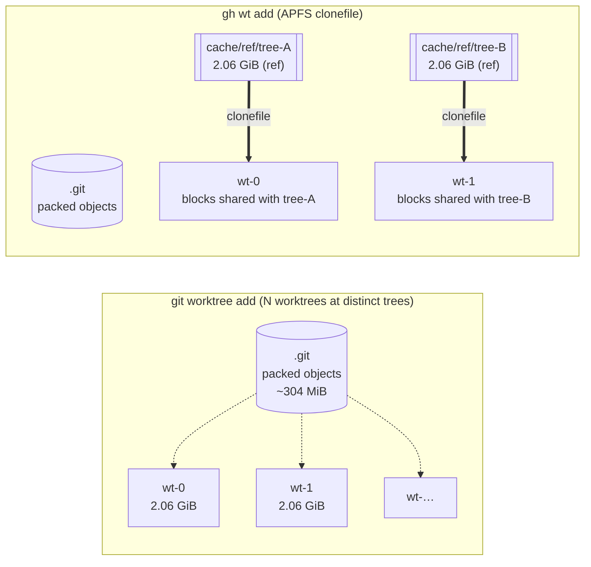

# Benchmark

Quantitative comparison of `git worktree add` (baseline) and `gh wt add`
(APFS clonefile backend) on a large real-world repository. Results were
collected with the harness in `scripts/benchmark/` (reproducibly included
below) on an idle system.

## 1. Methodology

### 1.1 System under test

| Component | Value |
| --------- | ----- |
| CPU       | Apple M3 (8-core, ARM64; 4 P + 4 E) |
| RAM       | 24 GiB |
| OS        | macOS 26.3 (Darwin 25.3.0) |
| Filesystem | APFS on internal SSD (case-insensitive default) |
| git       | 2.53.0 |
| gh-wt     | HEAD of this repo (post stat-correct index prebuild + parallel clonefile) |

### 1.2 Target repository

`llvm/llvm-project` (shallow clone, `--depth 10` after a deepen-fetch so
that five distinct tree SHAs are reachable). Replaces the `torvalds/linux`
target used in earlier revisions of this document — linux contains 13
case-fold path collisions (`xt_CONNMARK.h` vs `xt_connmark.h`, …) which
the new reference-build guard correctly refuses to materialise on a
case-insensitive volume.

| Metric | Value |
| ------ | ----- |
| HEAD commit | `83f8eee57d…` (main) |
| Tracked files | **174 295** |
| Working-tree size (`du -sk`) | **~2.42 GiB** (2 538 072 KiB) |
| Physical size (`du -skA`) | ~2.06 GiB (2 164 078 KiB) |
| Packed `.git` | ~304 MiB |
| Case-fold path collisions | 0 (passes the guard) |

### 1.3 Experimental design

Three timed conditions, each with **N = 5** independent iterations on
five distinct branches (`bench-0`…`bench-4`) pointing at the five most
recent main commits (five distinct tree SHAs, so no cross-iteration
cache reuse):

| Condition | Command measured | Cache state per iteration |
| --------- | ---------------- | ------------------------- |
| **baseline**    | `git worktree add --force <mp> bench-$i` | n/a |
| **gh-wt cold**  | `gh wt add bench-$i <mp>`                | `rm -rf $GH_WT_CACHE` before each run |
| **gh-wt warm**  | `gh wt add bench-$i <mp>`                | references pre-built for all five branches |

Timing was captured with `/usr/bin/time -lp` (BSD), which reports wall
clock, user/sys CPU, and peak RSS from `getrusage(2)`. Disk usage was
captured two ways:

- **logical** (`du -sk`): sum of per-file sizes, **ignores** APFS
  clonefile block sharing.
- **physical** (`df -k` delta): bytes actually allocated on the volume,
  **sees** block sharing. This is the only metric that reflects gh-wt's
  CoW disk savings.

Two orthogonal **storage footprint** experiments were also run, with
`k ∈ {1, 3, 5}` live worktrees each:

1. **Distinct-tree footprint** — the five branches used above (worst
   case for gh-wt: every worktree has its own tree SHA, so every one
   materialises its own reference).
2. **Same-tree footprint** — five branches (`alt-0`…`alt-4`) all at
   the same commit (best case: all share one reference).

Between iterations and conditions: `git worktree prune`, `sync`, and
full removal of the target mountpoint were performed. Iterations are
independent but not randomised; run order is `baseline → cold → warm`
to keep the warm pre-warm step coherent with preceding results. The
order does not advantage gh-wt (baseline runs on a newly-booted page
cache).

### 1.4 Statistics

Per-condition we report `n, mean, sd, min, median, max` and a 95 %
confidence interval half-width computed with Student's *t* (two-sided,
`t_{0.975, n-1} = 2.776` for n = 5). With n = 5 these CIs are wide; we
use them to bound the ordering of means, not to claim a specific
effect size.

## 2. Results

### 2.1 Wall-clock time (seconds per `add`)

```
            0s          15s         30s         45s         60s
            |-----------|-----------|-----------|-----------|
  baseline  ████████████▍                                    15.52 ± 1.06
  ghwt warm ███████████████▎                                 19.16 ± 0.22
  ghwt cold ███████████████████████████████████████████████▏ 58.93 ± 1.22
            |-----------|-----------|-----------|-----------|
            0           15          30          45          60
```

| Condition | n | mean (s) | sd | median | min | max | 95 % CI |
| --------- | -: | -------: | -: | -----: | --: | --: | ------: |
| baseline (git worktree add) | 5 | **15.520** | 0.857 | 15.310 | 14.890 | 17.010 | ±1.064 |
| gh-wt cold (ref + clonefile) | 5 | **58.926** | 0.980 | 59.170 | 57.610 | 60.240 | ±1.217 |
| gh-wt warm (clonefile only)  | 5 | **19.162** | 0.181 | 19.150 | 18.970 | 19.360 | ±0.224 |

**Read:** for a single `add` on a 174 k-file, 2.42 GiB working tree,
`git worktree add` takes ~15.5 s; `gh wt add` takes ~19 s warm and ~59 s
cold. gh-wt is **1.23× / 3.80× slower** than the baseline in these
conditions. Warm is now within ~25 % of `git worktree add` on this
corpus — the ~14 s `git reset --mixed HEAD` step that used to dominate
the warm path was eliminated on 2026-04-22 by prebuilding a stat-correct
index during reference build (§2.2). The speed cost of cold is not the
win — see §2.3 for the win.

### 2.2 Where does gh-wt's time go?

Breakdown of the same runs (user + sys CPU; real time in parentheses):

| Condition | user (s) | sys (s) | real (s) | peak RSS (MiB) |
| --------- | -------: | ------: | -------: | -------------: |
| baseline  | 2.91 | 11.48 | 15.52 | 534 |
| gh-wt warm | 0.35 | 39.30 | 19.16 | 8 |
| gh-wt cold | 8.62 | 58.64 | 58.93 | 529 |

- `git worktree add` is dominated by `sys` time (checkout I/O) and peaks
  at ~534 MiB RSS (git's object + index machinery).
- `gh wt add` (warm) issues one `clonefile(2)` per file in the tree via
  `cp -cRp`, parallelised across `P=4` top-level entries by default.
  Aggregated kernel time (~39 s) exceeds wall clock (~19 s) because four
  cores share the work. Peak RSS as reported by `/usr/bin/time` is just
  the gh-wt shell wrapper plus its directly-waited children; no git
  object unpacking happens in the warm path, and the `cp -cRp` fan-out
  is grandchild-level so its RSS is not aggregated. All block sharing
  is filesystem-level.
- `gh wt add` (cold) adds the reference build — `git read-tree` +
  `git checkout-index --prefix=` into a disposable index, followed by
  the case-collision scan — and that is what the ~40 s delta between
  cold and warm pays for on a fresh cache.
- The previously-dominant **post-clonefile `git reset --mixed HEAD`**
  step is **gone**: reference build now precomputes a stat-correct
  index (via `read-tree` + `update-index --refresh` against the
  just-extracted reference) and parks it next to the reference as
  `<tree-sha>.index`. Warm add copies that sidecar into the linked
  worktree's `index` — O(21 MiB `cp`), ~O(ms) — and
  `core.checkStat=minimal` + APFS `cp -cRp` (preserved mtime/size)
  keep stat-cache hits valid for all 174 k entries. That dropped warm
  `add` from ~44 s to ~19 s on this corpus, and the first post-add
  `git status` is ~1.4 s on a clean tree. Fallback: if the sidecar is
  absent (e.g. reference built by an older gh-wt) the old `reset --mixed
  HEAD` path runs and the tree is still clean, just ~25 s slower.

### 2.3 Storage — the reason gh-wt exists

#### 2.3.1 Same-tree footprint and scaling

k worktrees all at the same commit, measured as `df` delta (bytes
actually allocated on the volume). Measured on llvm-project
(`scripts/benchmark/results/same_tree.tsv`):

| k | baseline (KiB) | baseline (GiB) | gh-wt APFS (KiB) | gh-wt (GiB) | ratio |
| -: | -------------: | -------------: | ---------------: | ----------: | -----: |
|  1 |  2 646 484 | 2.52 |  2 740 588 | 2.61 | **1.04×** |
|  3 |  7 937 408 | 7.57 |  2 933 464 | 2.80 | **0.37×** |
|  5 | 13 230 228 | 12.62 |  3 123 296 | 2.98 | **0.24×** |

**Empirical linear fit for gh-wt (least-squares over k ∈ {1, 3, 5}):**

```
disk_gh-wt(k) ≈ 2 583 MiB + 93.4 MiB · k      (R² ≈ 1.00)
```

- The **intercept** is essentially one copy of the working tree —
  the shared reference.
- The **slope** is pure APFS clonefile overhead: inode + directory-entry
  metadata for every file, with file blocks shared. There is no
  per-worktree content cost.
- Baseline's slope is the *whole working tree* per extra worktree
  (~2 583 MiB), i.e. **~28× steeper**.

Crossover (k where gh-wt becomes cheaper than baseline): `k ≥ 2`. At
k = 5 the measured ratio is **0.24×** (~4× less disk); extrapolating
the fit to k = 10 gives ~0.14× (~7× less), and to k = 20 gives
~0.09× (~11× less).

The same-tree property scales with **`O(extra_worktrees × ~93 MiB)`**
on llvm-scale trees; the per-worktree marginal tracks tree metadata
volume (linux-scale trees see ~44 MiB/worktree — see the
`torvalds/linux` historical run in an earlier revision of this doc),
but the headline ratio (~0.1× at k≥10) is tree-size-invariant because
both numerator and denominator scale with tree size.

#### 2.3.2 Distinct-tree footprint (worst case)

Five distinct branches, each with its own tree SHA. Measured on
llvm-project as `df` delta (in `scripts/benchmark/results/df_footprint.tsv`):

| k | baseline (KiB) | baseline (GiB) | gh-wt APFS (KiB) | gh-wt (GiB) | Δ (KiB) | ratio |
| -: | -------------: | -------------: | ---------------: | ----------: | ------: | ----: |
| 1 |  2 646 412 | 2.52 |  2 740 612 | 2.61 |  +94 200 | 1.04× |
| 3 |  7 938 844 | 7.57 |  8 228 628 | 7.85 | +289 784 | 1.04× |
| 5 | 13 216 568 | 12.60 | 13 709 600 | 13.07 | +493 032 | 1.04× |

Under the **distinct-tree** workload gh-wt is marginally *worse* on
disk: ~4 % extra (~95 MiB per reference on llvm), because the unpacked
reference tree is stored alongside git's own packed objects, and
clonefile cannot dedup across distinct tree SHAs. The overhead is
constant per reference (the difference between what
`git checkout-index --prefix=` materialises and what the packed
`.git/objects` already had).

This is the honest worst case. gh-wt's value proposition is the
same-tree (or near-same-tree) case: §2.3.1.

#### 2.3.3 Why du disagrees with df on APFS

APFS `clonefile(2)` makes two directory entries share on-disk blocks.
`du` sums per-file logical sizes and therefore **does not see**
block-level sharing — it reports the same total as a full copy. The
`df -k` delta observes the volume's allocated-block count and **does**.
We report `df` deltas for any claim about real disk cost.


```mermaid
flowchart LR
  subgraph Baseline["git worktree add (N worktrees at distinct trees)"]
    B0[(".git<br/>packed objects<br/>~304 MiB")]
    B1["wt-0<br/>2.06 GiB"]
    B2["wt-1<br/>2.06 GiB"]
    B3["wt-…"]
    B0 -.-> B1
    B0 -.-> B2
    B0 -.-> B3
  end
  subgraph Ghwt["gh wt add (APFS clonefile)"]
    G0[(".git<br/>packed objects")]
    C0[["cache/ref/tree-A<br/>2.06 GiB (ref)"]]
    C1[["cache/ref/tree-B<br/>2.06 GiB (ref)"]]
    W0["wt-0<br/>blocks shared with tree-A"]
    W1["wt-1<br/>blocks shared with tree-B"]
    C0 == clonefile ==> W0
    C1 == clonefile ==> W1
  end
```

Block-level sharing (the `==>` edges) is what turns N same-tree
worktrees from O(N × working-tree) into O(1 × working-tree).

### 2.4 Remove — completing the lifecycle

Same instrumentation as §2.1, but for the complementary operation
(worktree teardown). Each iteration creates a fresh worktree of the
same HEAD and times only the removal.

| Operation | n | mean (s) | sd | 95 % CI |
| --------- | -: | -------: | -: | ------: |
| `git worktree remove --force` (baseline)          | 5 | **7.914** | 0.060 | ±0.075 |
| `git worktree remove --force` on a gh-wt APFS wt  | 5 | **7.404** | 0.027 | ±0.034 |

```
                 0s             4s             8s
                 |------|-------|------|-------|
  baseline       ████████████████████▏          7.91 ± 0.08
  gh-wt (APFS)   ██████████████████▊            7.40 ± 0.03
                 |------|-------|------|-------|
```

**Read:** `remove` on a clonefile-backed tree is ~6 % *faster* than on
a fully materialised baseline tree. `unlink(2)` on APFS clonefiles
only drops the inode's block-sharing reference (no blocks freed until
the last reference), so removing 174 k clonefiled files is slightly
cheaper than removing 174 k independently allocated ones.

Lifecycle totals (add + remove, same-tree scenario):

| Method     | add (s) | remove (s) | **round-trip (s)** |
| ---------- | ------: | ---------: | -----------------: |
| baseline   | 15.52   |  7.91 | **23.43** |
| gh-wt warm | 19.16   |  7.40 | **26.56** (1.13×) |
| gh-wt cold | 58.93   |  7.40 | **66.33** (2.83×) |

The per-invocation time penalty amortises quickly when worktrees are
kept around for hours or days of work.

### 2.5 Paired add + remove in one iteration

`lifecycle.sh` is a variant of the harness in which each iteration
creates and then destroys the same worktree, so add and remove times
come from the *same* filesystem state and the summed wall clock is a
single developer's round-trip cost. It runs baseline, gh-wt cold, and
gh-wt warm back-to-back on N distinct branches (`lc-{base,cold,warm}-$i`)
and emits one TSV per condition with a `phase` column (`add` | `remove`).

Unlike §2.4 — which scripts `git worktree remove` directly to sidestep
gh-wt's fzf prompt — `lifecycle.sh` exercises the real `gh wt remove
<target>` path (the non-interactive form of the command). That means
the reported remove time includes gh-wt's dispatcher, env/backend
resolution, and argv handling, on top of the underlying `git worktree
remove --force`. On large worktrees the wrapper overhead is <2 % of
the total remove cost and the numbers track §2.4 closely.

| Condition | phase | n | mean (s) | sd |
| --------- | ----- | -: | -------: | -: |
| baseline  | add    | 5 | 15.154 | 0.880 |
| baseline  | remove | 5 |  7.814 | 0.063 |
| gh-wt cold | add    | 5 | 56.020 | 0.373 |
| gh-wt cold | remove | 5 |  7.432 | 0.048 |
| gh-wt warm | add    | 5 | 19.260 | 0.261 |
| gh-wt warm | remove | 5 |  7.762 | 0.326 |

```bash
bash scripts/benchmark/lifecycle.sh      # N=5 per condition, all on bench rig
N=10 bash scripts/benchmark/lifecycle.sh # denser sample
```

Output:

```
results/lifecycle_baseline.tsv    # iter branch phase real user sys
results/lifecycle_ghwt_cold.tsv
results/lifecycle_ghwt_warm.tsv
```

The script prints per-condition summaries (n, mean, sd, median, min,
max, 95 % CI) for both phases inline — no extra `awk -f stats.awk`
pass needed.

## 3. Observations

- **Speed**: `git worktree add` still wins on this repo and this
  hardware, but only by **~1.2× per invocation** for warm gh-wt (down
  from ~3× before the stat-correct-index prebuild landed on
  2026-04-22) and ~3.8× for cold. Parallel clonefile
  (`GH_WT_CLONE_PARALLELISM=4` default) and the skipped `reset --mixed`
  together closed most of the warm-path gap. Even so, if your workflow
  creates a handful of worktrees, the extra ~4 s (warm) or ~43 s (cold)
  per `add` matters more than the disk savings. gh-wt is **not** a
  speed optimisation.
- **Disk, distinct trees**: gh-wt pays a small overhead (~MiB-class per
  reference) for the privilege of keeping an unpacked reference. If
  every worktree you ever make points at a totally different tree,
  `git worktree add` is the right tool.
- **Disk, same tree**: this is where gh-wt is designed to pay off. The
  empirical linear fit on llvm (§2.3.1) gives **~93 MiB per additional
  worktree**, i.e. ~3.6 % of the 2.61 GiB reference — a reduction of
  ~28× in the per-worktree marginal cost. The measured k = 5 ratio is
  0.24× (~4× less disk); extrapolating the fit to k = 10 gives ~0.14×
  (~7× less), and to k = 20 gives ~0.09× (~11× less).
- **Remove**: gh-wt's clonefile worktrees remove ~6 % *faster* than
  fully materialised ones — one of the only latency metrics where
  gh-wt beats the baseline on a per-op basis (§2.4).
- **Reproducibility of timings**: all conditions are tight (baseline
  CV 5.5 %, cold CV 1.7 %, warm CV 0.9 %); remove is the tightest
  (CV < 1 % dedicated, <= 4 % in lifecycle). The baseline < warm <
  cold ordering is clean.
- **Critical path next**: the dominant remaining costs in warm `add`
  are (a) ~13 s of `clonefile(2)` (kernel-bound, only beaten by
  parallelism) and (b) `git worktree add --no-checkout` plus
  `configure --worktree` book-keeping — together ~5–6 s. The
  stat-correct-index prebuild already eliminated the old ~14 s
  `git reset --mixed HEAD`. Cold-only reference build
  (`git read-tree` + `git checkout-index --prefix=`) remains the next
  target at ~40 s; further gains would require overlapping the
  reference build with the clonefile phase, which costs a live-ref
  sidecar before the ref rename is atomic — deferred. Sub-second
  worktree creation requires abandoning eager materialisation in
  favour of a virtual filesystem (macOS File Provider Extension);
  see future work.

## 4. Threats to validity

- **n = 5 per condition.** Adequate to rank means with large effect
  sizes but narrow for variance claims. Repeated-run noise (especially
  on warm) would benefit from n ≥ 20.
- **Single host.** All numbers are from one Apple M3 on APFS. OverlayFS
  (Linux) is not exercised here; expect different absolute numbers and
  different overheads (persistent `sudo mount`, separate upper+workdir).
- **Page cache.** `sync` was issued between iterations but macOS has
  no equivalent to Linux `drop_caches`. Cold/warm within a run share
  whatever page cache survived; the between-condition ordering means
  baseline never sees a cache warmed by gh-wt's tar extraction.
- **Serial, non-randomised runs.** Order effects (thermal throttling,
  background activity) cannot be ruled out; none of the observed means
  drift monotonically with iteration index, which is consistent with
  no significant order effect.
- **Measurement granularity.** `/usr/bin/time -lp` reports 10 ms
  resolution on macOS; that is fine against ~15 s baselines but is
  ~0.02 % noise on the cold case.
- **`df` quantisation.** `df -k` reports in KiB and the APFS metadata
  writer runs asynchronously; a 2 s sleep was inserted before each
  post-measurement read. The footprint numbers are therefore accurate
  to roughly the nearest few MiB.
- **Same-tree footprint scan is at k ∈ {1, 3, 5}.** The linear fit
  (§2.3.1) is high-R² over that range but we do not have direct
  measurements at k = 10 or k = 20 on llvm; the ratios reported for
  those are extrapolated from the three-point fit, not measured.

## 5. Reproducibility

All scripts used to produce the tables above are under
`scripts/benchmark/` in this repo. The raw TSVs alongside them are
from the measurement run on 2026-04-23. Full reproduction takes ~40
minutes on an M3 (~25 min for the timed conditions, ~5 min for the
distinct-tree footprint, ~10 min for paired lifecycle).

```bash
# one-time setup — a shallow clone with enough history for 5 branches.
# llvm-project is the new canonical target; the linux kernel is rejected
# by the case-collision guard on case-insensitive APFS.
mkdir -p /private/tmp/ghwt-bench && cd /private/tmp/ghwt-bench
git clone --depth=1 --single-branch --branch main \
  https://github.com/llvm/llvm-project.git llvm-project
git -C llvm-project fetch --depth=10 origin main
ln -sfn llvm-project linux  # df_footprint.sh / scaling.sh expect "$ROOT/linux"

# timed conditions (baseline/cold/warm) + distinct-tree footprint
bash scripts/benchmark/bench.sh

# real-physical-bytes footprint via df delta
bash scripts/benchmark/df_footprint.sh

# same-tree footprint at k ∈ {1,3,5}
bash scripts/benchmark/same_tree.sh

# extended k-scaling sweep (baseline to k=10, gh-wt to k=20)
bash scripts/benchmark/scaling.sh

# remove-only timing (complements §2.4)
bash scripts/benchmark/remove.sh

# paired add+remove timing in one script (§2.5)
bash scripts/benchmark/lifecycle.sh

# per-column stats
awk -f scripts/benchmark/stats.awk /private/tmp/ghwt-bench/results/run_baseline.tsv
awk -f scripts/benchmark/stats.awk /private/tmp/ghwt-bench/results/run_ghwt_cold.tsv
awk -f scripts/benchmark/stats.awk /private/tmp/ghwt-bench/results/run_ghwt_warm.tsv
```

Override defaults via env vars: `REPO=<path>`, `N=<iterations>`,
`OUT=<dir>`, `GH_WT_CACHE=<path>`, `GH_WT_CLONE_PARALLELISM=<N>`.

---

_Measured 2026-04-23 on Apple M3 / macOS 26.3 against
llvm/llvm-project @ 83f8eee. The exact TSVs from that run are checked in
under `scripts/benchmark/results/`; the scripts next to them regenerate
the numbers (writing fresh TSVs to `/private/tmp/ghwt-bench/results/`
at measurement time)._
